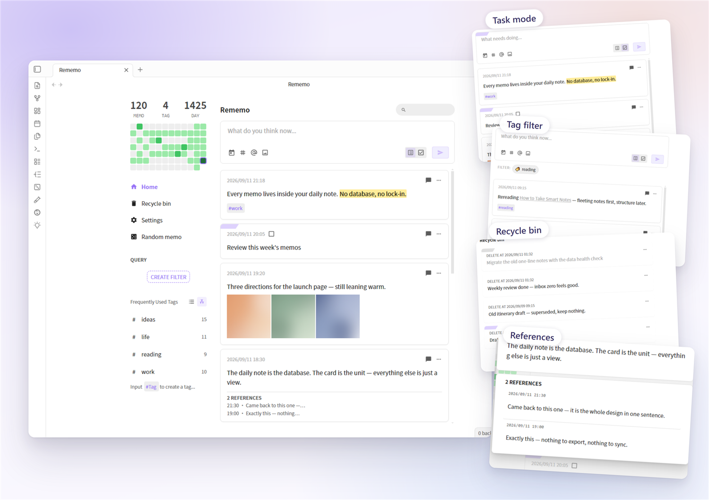
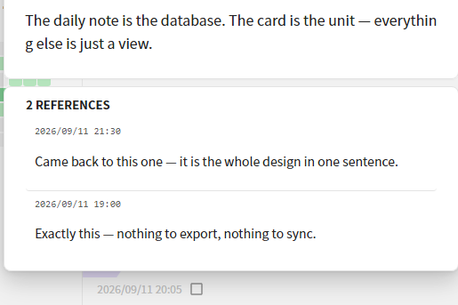

# Rememo

> Capture fleeting thoughts straight into your daily notes. Every memo is a card block in your own note files — no private database.

**English** | [中文](README.zh.md)

Rememo is a memo plugin for [Obsidian](https://obsidian.md): a heavily rewritten fork of [Obsidian-Memos](https://github.com/Quorafind/Obsidian-Memos) (previously named “Memos Plus”). All memos live inside **your daily notes** — plain Markdown, readable and editable at any time, yours to keep.

## Screenshots



|  |  |
|---|---|
| <br><sub>**Task mode** — the two-segment slider next to the send button turns what you type into a task card</sub> | <br><sub>**Tag filter** — click any tag to filter the feed</sub> |
| <br><sub>**Recycle bin** — deleted cards stay in your note and can be restored</sub> | <br><sub>**References** — replies are reference cards, gathered under the memo they answer</sub> |

## Features

- **Native-feeling editor** — built on Obsidian's own editor kernel: typing, IME, undo, live rendering of `==highlights==`, `#tag` and `[[wikilink]]` autocomplete. Press `Enter` or `Ctrl/Cmd+Enter` to send.
- **Card feed** — memos from your daily notes rendered as a paginated card list; filter by text, tag, saved query or date; heat map and tag tree in the sidebar.
- **Task cards** — start a line with `- [ ]` to create a task; tick the checkbox on the card to complete it. A two-segment slider next to the send button switches between plain memos and tasks — and follows the card's type when you edit it.
- **Tags** — tag chips gathered at the bottom of the card, or kept inline where they appear (a setting); click any tag to filter.
- **Recycle bin** — deleting is a *soft* delete: the card stays in your note with a `deletedAt` marker, and can be restored or permanently removed from the recycle bin; optional auto-clean purges entries older than the retention period.
- **Send sound** — an optional card-deal “whoosh” when a memo is sent: choose the built-in sound or your own audio file, with a volume slider.
- **Share as image** — export a single card or a whole day as an image (configurable footer and background).
- **Data health check** — a built-in audit that repairs anomalies and migrates the old single-line format into card blocks, with automatic backups.
- **Mobile support** — works on phones and tablets; accepts text and files via “Insert as memo”.

## Installation

**From the community plugin directory** — search for “Rememo” in Settings → Community plugins → Browse. *(Available once the directory review is done.)*

**Manually** — copy `main.js`, `styles.css` and `manifest.json` into `<your vault>/.obsidian/plugins/rememo/`, then enable **Rememo** in Settings → Community plugins.

Requires Obsidian **1.5.0** or newer.

## Quick start

1. Enable the core **Daily notes** plugin — Rememo reads and writes your daily notes.
2. Open Rememo's settings and confirm **“Memo heading”** matches your daily-note template (`## Memo` by default). New memos are written under this heading; if the file doesn't have it yet, Rememo creates it.
3. Click the Rememo icon in the ribbon (or run the **Open Memos** command from the command palette).
4. Type a thought and send it — open today's daily note and you'll find it as a card block.

## What your notes look like

```markdown
## Memo

- 14:32:15 ^a1b2c3
    Plain text with **bold**, `code`, #tag, [[wikilink]] or ![[image]] —
    blank lines start new paragraphs, full Markdown works

- [x] 14:40:00 ^d4e5f6
    A task card — ticking the box writes back to the heading line

- 14:45:00 deletedAt: 2026-09-05 14:45:00 ^g7h8i9
    A deleted card — still in place, restorable from the recycle bin
```

A card block is a heading line `- [ ]? HH:mm:ss [deletedAt: …] ^id` with the body indented by 4 spaces below it; the `^id` is maintained by Obsidian itself. The old single-line format (body on the heading line) is no longer rendered — use **Data health check → migrate whole file** to convert it (backups are made automatically).

## Settings highlights

- **Memo heading** — one setting for both reading and writing: Rememo only reads below this heading, and writes new memos at the end of that section (creating the heading if it's missing). Default: `## Memo`.
- **Send memo by Enter key** — off (default): `Enter` inserts a newline, `Ctrl/Cmd+Enter` sends. On: reversed.
- **Tag position** — tags gathered at the card bottom (default) or kept inline in the text.
- **Send sound** — the built-in card-deal sound, your own audio file, or none; with a volume slider.
- **Recycle bin** — enable/disable soft delete; auto-clean retention (never / 7 / 30 / 90 / 180 days).
- **Heat map** — show or hide, week start day.
- **Time display format** — display only; files always store `HH:mm:ss`.

## Building

```bash
pnpm install
pnpm build   # produces main.js + styles.css
```

Copy the artifacts into your vault's plugin folder and reload the plugin in Obsidian (do a full restart if changes don't show up).

## Credits

Built on top of [Obsidian-Memos](https://github.com/Quorafind/Obsidian-Memos) by [Boninall (Quorafind)](https://github.com/Quorafind/), with design inspiration from [memos](https://github.com/justmemos/memos) and [flomo](https://flomoapp.com/).

## License

[MIT](LICENSE)
