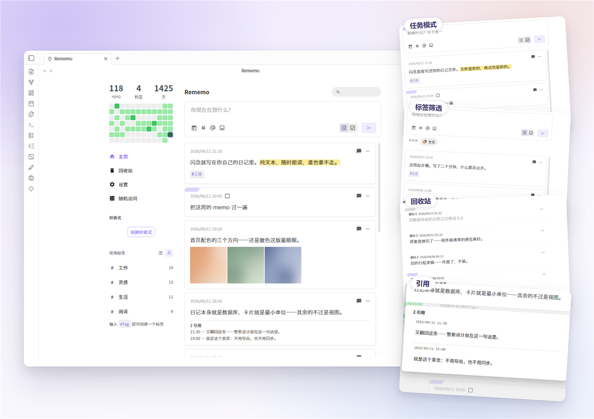
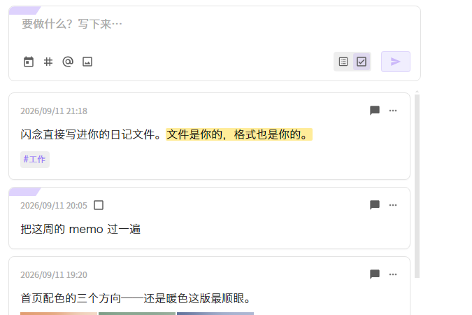
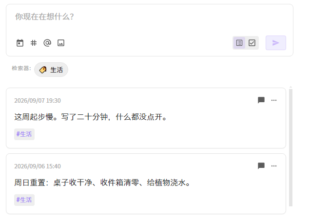
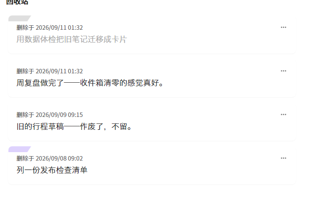
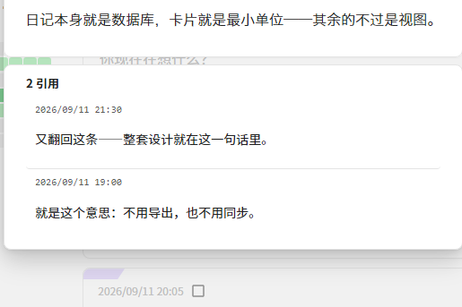
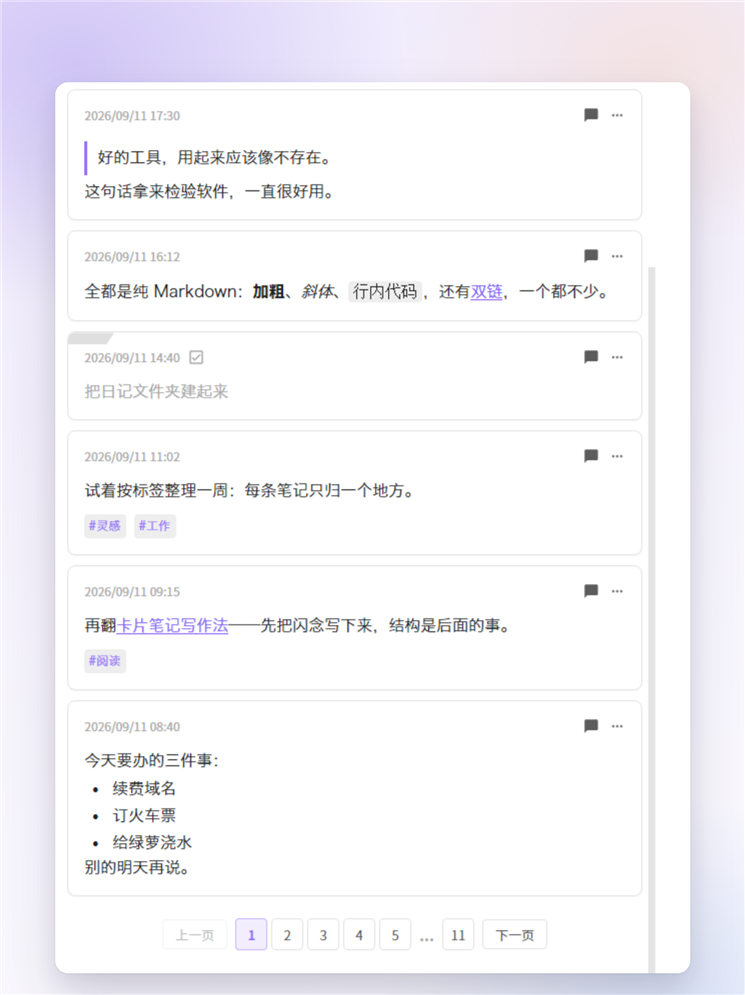

# Rememo

> 把闪念写进你的日记。所见即文件：每条 memo 就是日记文件里的一张卡片块。

[English](README.md) | **中文**

Rememo 是 Obsidian 备忘录插件，源自 [Obsidian-Memos](https://github.com/Quorafind/Obsidian-Memos) 的增强重写（曾用名 Memos Plus）。所有 memo 都存储在**你的日记文件**里，不做私有数据库——Obsidian 文件归你，随时可读、可改、可迁移。

## 截图



|  |  |
|---|---|
| <br><sub>**任务模式** —— 发送键旁的双段滑块，把这条闪念写成任务卡</sub> | <br><sub>**标签筛选** —— 点任意标签即可筛选列表</sub> |
| <br><sub>**回收站** —— 删除的卡仍留在日记里，可随时恢复</sub> | <br><sub>**引用** —— 回复即引用卡，聚合在被回复的卡下</sub> |


<sub>**首屏之外** —— 引用块、行内格式（`**加粗**`、`*斜体*`、行内代码）、双链、标签胶囊、已完成任务与列表，全部由你自己的 Markdown 原样渲染。</sub>

## 特性

- **原生编辑体验的输入框**：基于 Obsidian 内核编辑器——打字/换行/中文输入、撤销、`==高亮==` 实时渲染、`#tag` 与 `[[链接]]` 联想；Enter 或 Ctrl/Cmd+Enter 发送
- **卡片流浏览**：日记里的 memo 以卡片列表呈现，分页加载，按文本/标签/查询/日期过滤；侧栏带热力图与标签树
- **任务卡**：`- [ ]` 输入即任务，卡片上的勾选框直接完成；发送键旁边的**双段滑块**切换 普通/任务——编辑已有卡时自动跟随该卡类型
- **标签**：默认抽到卡片底部，也可设为**原位保留**在句子里（设置项）；点任意标签即按标签筛选
- **回收站**：删除是**软删**——memo 留在原日记、带 `deletedAt` 标记，可在回收站恢复或永久删除；可设保留期自动清理（默认永不）
- **发送音效**：发送时播放发牌声（可换自己的音频文件 / 关闭，带音量）
- **分享成图片**：单张卡片或整日日记一键生成图片（可配页脚/背景）
- **数据体检**：内置修复工具，扫描异常数据、把旧版单行格式整文件迁移为卡片块（自动备份）
- **移动端可用**，支持接收文本/文件「存为 memo」

## 安装

**从社区插件市场安装** —— 设置 → 第三方插件 → 浏览 → 搜索 “Rememo”。

**手动安装** —— 将 `main.js`、`styles.css`、`manifest.json` 放入
`你的库/.obsidian/plugins/rememo/`，然后在 Obsidian 的第三方插件列表里启用 **Rememo**。

需要 Obsidian **1.7.2** 及以上。

## 从旧版 Memos（或「Memos Plus」）迁过来？先看这里

**你的 memo 没丢。** Rememo 读的就是你日记文件里已有的 memo——它不会自己搬动、改写或删除任何东西。

有一件事要先知道：旧版 Obsidian-Memos 写下的 memo 是**旧的单行格式**，而 Rememo 只渲染新的卡片块格式。所以刚装好时，你原来的 memo 不会出现在列表里——它们**还好好地躺在你的文件里**，只是没被显示。

**用内置的迁移把它找回来：**

1. 打开 Rememo 设置 → 「**数据工具**」→ 「**数据体检**」
2. 体检会扫描你的日记，列出所有含旧格式行的文件
3. 点文件旁的「整文件迁移」，或用「一键迁移全部旧文件」一次转完
4. 写盘前每个文件都会先备份到 `.rememo-backup/`，随时可以手工还原

迁移会做什么（**只动「Memo 区标题」下面的那一段**）：

- 旧单行 memo → 卡片块（头行 + 4 空格缩进的正文）
- 旧的缩进评论子树 → **引用卡**（对应 Rememo 的"评论 ≡ 引用"模型）
- 笔记里的其它内容一律不动

你原来的设置也继续有效：**Memo 区标题**默认就是 `## Memo`——旧插件写入用的正是这个标题。

## 快速开始

1. 启用 Obsidian 核心插件「**日记**」（Rememo 的读写目标就是日记文件）
2. 打开 Rememo 设置，确认「**Memo 区标题**」与你的日记模板一致（默认 `## Memo`）——新 memo 写在这个标题下；文件里没有该标题时 Rememo 会自动创建
3. 点击左侧栏的 Rememo 图标（或命令面板执行「Open Memos」）打开
4. 输入一条闪念，发送——打开今天的日记，就能看到它变成一张卡片块

## 你的日记文件长什么样

```markdown
## Memo

- 14:32:15 ^a1b2c3
    闪念正文，支持 **粗体**、`代码`、#tag、[[双链]]、![[图片]]，
    空行分段；列表、代码块等块级格式都行

- [x] 14:40:00 ^d4e5f6
    任务卡：勾选会写回头行

- 14:45:00 deletedAt: 2026-09-05 14:45:00 ^g7h8i9
    已删除的卡（留在原处，回收站里可恢复或永久删除）
```

格式约定：头行 = `- [ ]? HH:mm:ss [deletedAt: …] ^id`（纯标识，正文从下一行 4 空格缩进开始，支持完整 Markdown）；`^id` 由 Obsidian 维护。旧版单行格式（正文写在头行里）不渲染，用「数据体检 → 整文件迁移」转成新格式（自动备份）。

## 设置要点

- **Memo 区标题**：读写共用这一个设置——只读该标题下的内容，新 memo 写在该小节末尾（缺失时自动创建，建在文件末尾）。默认 `## Memo`
- **按 Enter 直接发送**：关（默认）= Enter 换行、Ctrl+Enter 发送；开 = 反过来
- **标签位置**：沉底（默认）/ 原位保留在句中
- **发送音效**：内置·发牌声 / 自定义库内路径 / 不播放；带音量滑条
- **回收站**：总开关 + 自动清理保留期（永不 / 7 / 30 / 90 / 180 天）
- **热力图**：显示开关、周起点
- **时间显示格式**：只影响显示，落盘始终 `HH:mm:ss`

## 从命令行构建

```bash
pnpm install
pnpm build      # 产出 main.js + styles.css
```

把产物复制到上面的插件目录，在 Obsidian 里重载插件（若改动未生效，完整重启 Obsidian）。

## 致谢

本项目基于 [Boninall (Quorafind)](https://github.com/Quorafind/) 开发的 [Obsidian-Memos](https://github.com/Quorafind/Obsidian-Memos)，设计灵感来自 [memos](https://github.com/justmemos/memos) 与 [flomo](https://flomoapp.com/)。

## 许可

[MIT](LICENSE)
